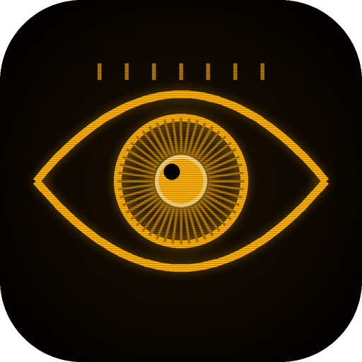
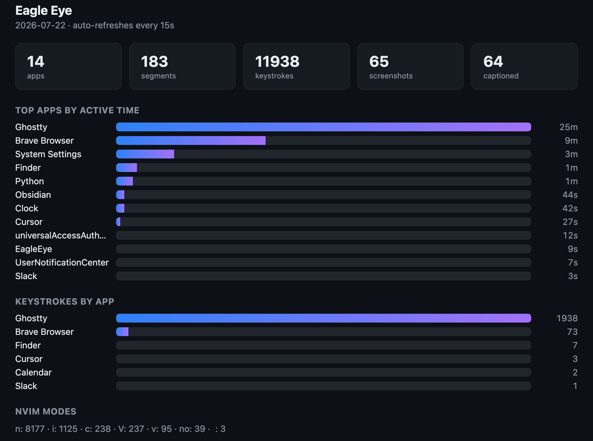
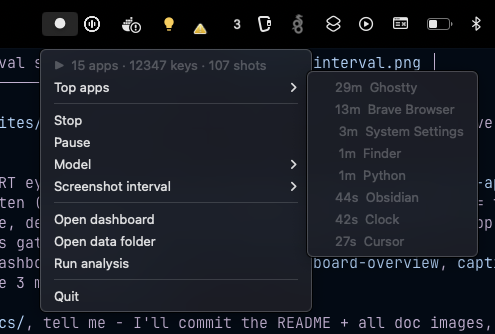
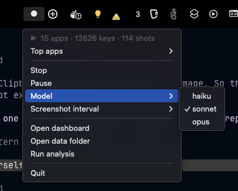
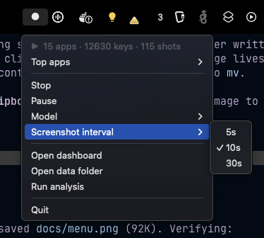
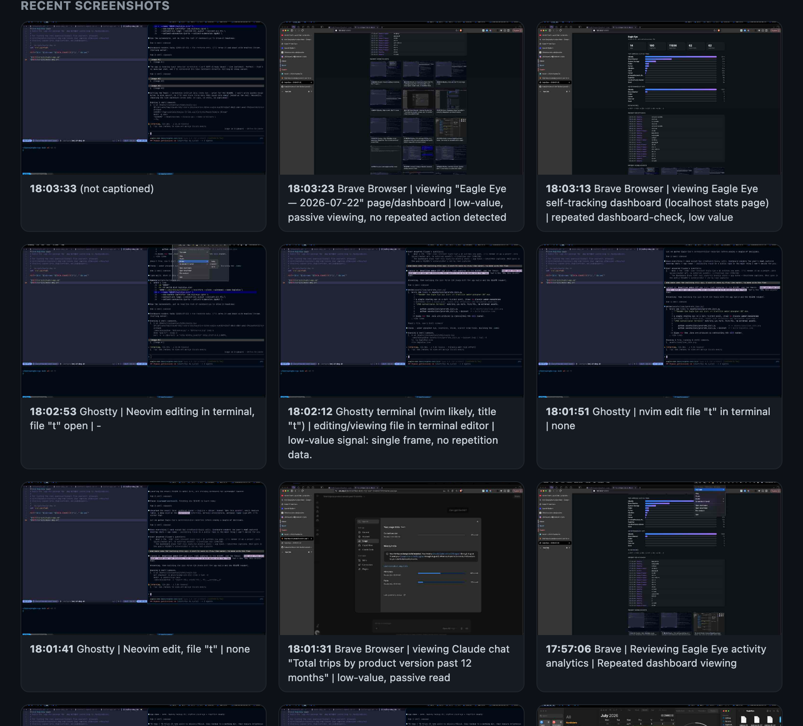
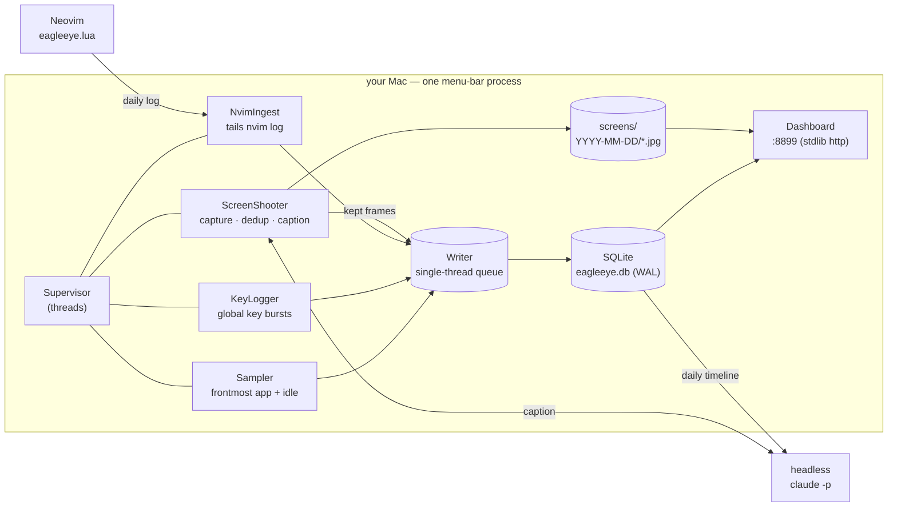
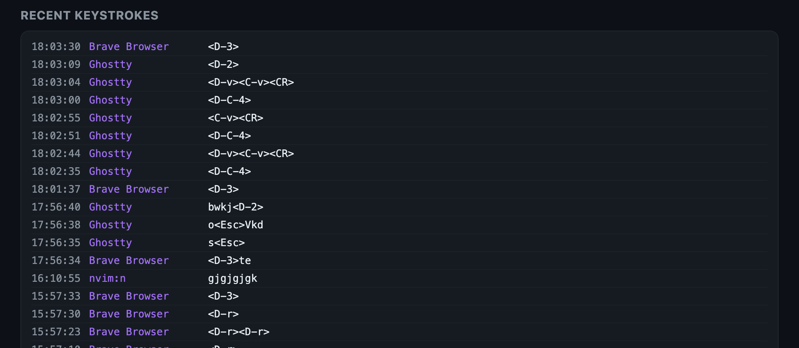

<div align="center">



# Eagle Eye

**A local-only macOS tracker that watches how you _actually_ work — app-time, keystrokes, and screenshots captioned by a cheap LLM — so you can find the friction and smooth it out.**

*Be water. You can't make your flow like water until you can see where it snags.*

<br>



</div>

---

## Why this exists

Three honest reasons:

1. **I wanted my flow to move like water.** Most of the day's friction is invisible — the third time you reach for the arrow keys in Neovim, the tab you re-open every ten minutes, the command you retype instead of aliasing. You can't smooth a snag you can't see. Eagle Eye is a mirror for my own workday: it watches, so I can move with the flow instead of against it.
2. **RescueTime/Timing are subscriptions that phone home.** I didn't want my keystrokes and screen on someone else's server. Eagle Eye is a single menu-bar app writing to **one SQLite file on my Mac**. Nothing leaves the machine except the screenshot captions — and those go to a model _I_ run headless, on _my_ key.
3. **I already pay for Claude.** The interesting half of "what was I doing at 3pm" is a one-line description of the screen. A cheap model (`haiku`) captions every frame for fractions of a cent, and a nightly pass reads the whole day back to me as a ranked list of things to fix. No new SaaS. No new bill.

<div align="center">


*Lives in the menu bar. One glance: apps, keystrokes, shots captured today.*
</div>

---

## What it does

| | |
|---|---|
| 👁 **Passive, all day** | A menu-bar agent (no Dock icon) samples the frontmost app, logs keystrokes per-app, and grabs a screenshot every N seconds. Start/Stop/Pause from the menu; nothing to babysit. |
| 🧠 **Every frame captioned** | Each kept screenshot is described in one line by headless Claude Code (`app \| activity \| repeated-or-low-value signal`) — so "what was I doing at 15:47" has a real answer, not a thumbnail you have to squint at. |
| 🔭 **Perceptual dedup** | Idle on the same screen? A difference-hash (dHash) drops frames that are visually identical to the last kept one — no wasted disk, no wasted LLM call — with a heartbeat so long-static screens still refresh. |
| ⌨️ **Keystrokes, with editor context** | A global logger coalesces keys into bursts per app. A companion Neovim plugin logs keys _with the current mode_ (`n`/`i`/`v`/`c`…), so Eagle Eye sees `ciwhello<Esc>` as Normal-mode editing — context the OS can't provide. |
| 📈 **Live dashboard** | A tiny local web page: top apps by active time, keystrokes by app, nvim mode split, the recent keystroke stream, and a grid of captioned screenshots. Auto-refreshes; served straight from the SQLite DB. |
| 🧾 **Nightly analysis → a ledger of fixes** | On demand (or scheduled), headless Claude reads the whole day's timeline and appends to an **observations ledger** — repeated low-value actions, ranked by time saved, each with a concrete fix (remap, alias, macro, extension). Patterns at `count ≥ 3` are flagged as confirmed. |
| 🔒 **Local-only by construction** | One SQLite file + a folder of JPEGs under `~/Documents/EagleEye`. No account, no telemetry, no cloud. Delete the folder and it never happened. |

<div align="center">
 

*Swap the captioning model and capture cadence live, from the menu.*
</div>

---

## The capture loop, explained

The interesting part isn't "take a screenshot." It's turning a noisy stream of pixels and keypresses into something you'd actually read back — cheaply, and without lying to you about what you were doing.

### The plain-English version

Every few seconds Eagle Eye grabs the screen. Most of those frames are boring — you were reading, or away, or the clock ticked a minute. Sending each one to an LLM would be wasteful and slow. So before anything is kept, the frame is compared to the last one it _did_ keep; if they're perceptually the same, it's dropped on the floor. What survives is captioned by a cheap model that's been told the **ground truth** (the real foreground app + window title), so it can't hallucinate "VS Code" when you're actually in Neovim inside a terminal. Keystrokes ride alongside on a separate stream, coalesced into bursts and — inside Neovim — tagged with the editing mode. At the end of the day a bigger read pass turns all of it into a short, ranked list of things slowing you down.

### The lifecycle of a frame

```
                      dHash within N bits of last kept?
   screencapture ──▶ downscale (sips) ──▶ ┌─ yes ─▶ DROP (no file, no caption)
      every Ns                            └─ no  ─▶ KEEP ─▶ row in SQLite
                                                              │
                                                    queue ▼ (N caption workers)
                                          headless `claude -p` + ground truth
                                                              │
                                                     one-line desc ▶ UPDATE row
```

- **Capture** — `screencapture -x` (no shutter sound), then `sips` downscales to `max_width` and re-encodes JPEG. Skipped entirely if you've been idle longer than `idle_skip`.
- **Dedup** — a 64-bit **difference hash** of a 9×8 grayscale thumbnail. Two visually identical screens land within a few bits (Hamming distance) of each other, so menu-clock ticks and cursor blinks don't count as change. A `dedup_max_skips` heartbeat forces a fresh frame after a long static stretch.
- **Caption** — a pool of workers pulls kept frames off a queue and shells out to `claude -p` with the cheap model. Every frame is captioned; enough workers run concurrently to keep up with the capture rate.
- **Store** — the description lands back on the same row, `described_at` stamped.

### The ground-truth trick

A vision model looking at a terminal full of code will happily call it "VS Code." That would poison the whole day's analysis. So the caption prompt is _grounded_ in what the OS already knows for certain:

```
Ground truth: the foreground app is "Ghostty" (window title: "nvim main.py").
Trust this for the app name; do NOT guess a different editor. If the app is a
terminal (Ghostty/iTerm/…) or tmux, any code editor shown is Neovim/Vim, never
VS Code. Reply ONE line: app | activity | repeated-or-low-value-action-signal.
```

The foreground app and window title come from `NSWorkspace` + the Accessibility API; browser tab URLs come from a tiny per-browser `osascript`. The model fills in only the _activity_ and the _low-value signal_ — the facts stay facts.

### Keystrokes, and why Neovim gets its own channel

The OS-level logger (via `pynput`) sees keys but not meaning — it can't tell Normal-mode `dd` from typing "dd". So the Neovim side logs its own stream, mode-aware, to a daily file that Eagle Eye tails into the same table:

```
[15:47:02] n   ciwhello<Esc>
[15:47:09] i   def flow():<CR>
--- file: /Users/me/eagle-eye/app.py
```

Both streams coalesce runs of keys into **bursts** (flushed on app-change or an idle gap) and store a rendered token string. `<C-w>` counts as **one** keystroke, not five — the token counter understands `<…>` sequences — so "keystrokes by app" reflects effort, not char count.

### The nightly read-back

`Run analysis` (menu or `eagleeye analyze`) compiles the day — app segments, keystrokes-by-app, nvim modes, screen captions — into a markdown timeline, then hands it to headless Claude with a runbook. The model appends to an **append-only ledger**:

| pattern | source | count | first seen | last seen | status | suggested fix |
|---|---|---|---|---|---|---|
| arrow keys used for motion instead of `hjkl` | nvim | 4 | 07-18 | 07-22 | open | remap arrows to no-op; build the habit |
| re-opening the same three tabs hourly | Brave | 3 | 07-20 | 07-22 | open | pin them / a session shortcut |

A pattern seen on **three separate days** graduates from noise to a confirmed inefficiency worth an afternoon's fix. That's the whole point of the tool: the ledger is the to-do list for making the flow move like water.

<div align="center">


*Every kept frame, captioned. The rightmost column is the "low-value / repeated" signal the nightly pass mines.*
</div>

---

## How it's built (and why)

The design goal was **one process, no server, no account** — something that runs for months in the menu bar and never asks for attention.



- **One supervisor, watchers as threads.** `rumps` owns the main-thread NSApplication run loop; the Sampler, ScreenShooter, KeyLogger and NvimIngest run as daemon threads. `pynput`'s macOS backend spins its own `CFRunLoop`, so it coexists with the menu-bar loop.
- **Every write goes through one Writer thread.** Watchers never touch SQLite directly — they enqueue rows and a single Writer drains the queue, so there's exactly one connection mutating the DB. Reads (dashboard, menu counts) run under WAL and never block capture.
- **Content vs. derived are separate.** Screenshots are JPEGs on disk; the DB stores rows that _reference_ them. Blow away `screens/` and the timeline still reads; blow away the DB and the JPEGs are still there.
- **The dashboard is stdlib.** A `ThreadingHTTPServer` renders today's page from the DB on each request and serves screenshots straight from the data dir. No framework, no build step.

### The data model

One SQLite file, three streams, joined by timestamp:

| Table | One row is… | Key columns |
|---|---|---|
| `app_usage` | a segment of time in one app | `app`, `title`, `url`, `ts_start/end`, `duration`, `was_idle` |
| `keystroke` | a burst of keys in one context | `source` (`global`/`nvim`), `app`, `mode`, `tokens`, `n_keys` |
| `screen_capture` | one kept frame | `file`, `desc`, `described_at` |

<div align="center">

</div>

---

## Permissions (and the startup gate)

Eagle Eye is, by design, a thing that watches your screen and keyboard. macOS gates that behind TCC, and so does the app:

- **Accessibility** — _required_. Supplies focused-window titles (the ground truth that keeps captions honest) and is the permission macOS prompts for. **The app refuses to start without it**: on launch it checks trust, prompts, and if still denied shows a "grant it, then relaunch" alert and exits.
- **Screen Recording** — needed for non-blank screenshots. Degrades gracefully (blank frames) if withheld.
- **Input Monitoring** — needed for the global keystroke logger. Without it, keystroke tracking is simply empty; everything else runs.

Grant them under **System Settings → Privacy & Security**. Because the bundle is code-signed (ad-hoc) with a stable identity, the grant sticks across restarts.

---

## Install

**DMG (recommended):** grab the latest `EagleEye-x.y.z.dmg` from [Releases](../../releases), open it, drag **Eagle Eye** to Applications, and launch.

The app is unsigned by Apple (no paid Developer ID), so a downloaded DMG is quarantined. First launch: **right-click → Open**, or clear the flag:

```bash
xattr -dr com.apple.quarantine /Applications/EagleEye.app
```

Then launch, grant Accessibility (+ Screen Recording / Input Monitoring), and relaunch.

### The Neovim plugin (optional, recommended)

For mode-aware editor keystrokes:

```bash
editor/nvim/install.sh     # copies eagleeye.lua, wires require("eagleeye") into init.lua
```

Idempotent; safe to re-run.

---

## Build from source

```bash
python3 -m venv .venv && . .venv/bin/activate
pip install -e .[dev]

scripts/build-app.sh              # build dist/EagleEye.app (no install)
scripts/build-app.sh --install    # build + copy to /Applications
scripts/build-dmg.sh              # build .app + package dist/EagleEye-<version>.dmg
```

PyInstaller embeds the interpreter in-process, so the bundle's executable stays named `EagleEye` — which is what TCC keys on, giving a **stable** Screen Recording / Accessibility grant across restarts. The icon is generated from source:

```bash
python assets/icon/generate_icon.py --iconset   # -> EagleEye.icns
```

Run unpackaged during development:

```bash
python eagleeye_launch.py     # menu-bar app, from the venv
eagleeye analyze              # run the nightly analysis by hand
```

---

## Configuration

Defaults live in `eagleeye/config.py`; override via `~/.config/eagleeye/config.toml` (menu changes persist to `overrides.json`).

| Setting | Default | What it does |
|---|---|---|
| `paths.data_dir` | `~/Documents/EagleEye` | where the DB + `screens/` live |
| `screenshot.interval` | `10` | seconds between frames (5/10/30 from the menu) |
| `screenshot.idle_skip` | `60` | skip capture after this many idle seconds |
| `screenshot.dedup_threshold` | `3` | max dHash bit-distance still counted "identical" |
| `screenshot.dedup_max_skips` | `30` | force a fresh frame after this many dropped |
| `analysis.model` | `haiku` | captioning + analysis model (haiku/sonnet/opus) |
| `keylog.idle_gap` | `1.0` | seconds of pause that ends a keystroke burst |

The `claude` CLI is discovered automatically (PATH, then the usual npm/nvm/Homebrew spots); set `EAGLEEYE_CLAUDE_BIN` to point at a specific binary.

---

<div align="center">
<sub>Built to watch one person work: me. Everything stays on the Mac it runs on.</sub>
</div>
